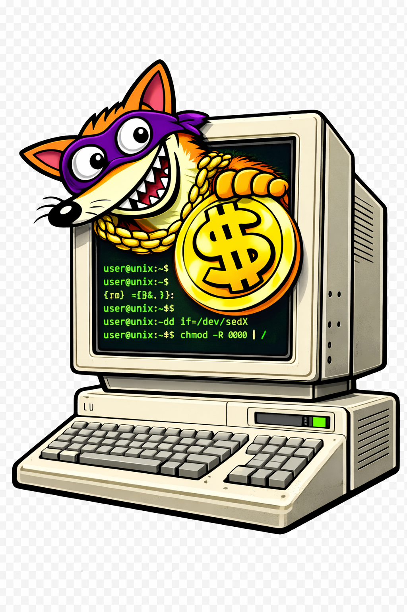

# WeezTerm

<p align="center">
  
</p>

<p align="center">
  <em>A fork of <a href="https://github.com/wezterm/wezterm">WezTerm</a> — the GPU-accelerated cross-platform terminal emulator and multiplexer written by <a href="https://github.com/wez">@wez</a> in <a href="https://www.rust-lang.org/">Rust</a> — with integrated remote SSH extensions.</em>
</p>

WeezTerm extends WezTerm with VS Code Remote SSH-style features:
- **Remote browser opening** — Programs on the remote host can open URLs in your local browser (e.g., `az login` interactive auth)
- **Automatic port forwarding** — Ports opened on the remote host are detected and forwarded to localhost, with smart conflict handling and multiplexed-domain support
- **Open-URL security** — Allow-list and policy-based validation (Allow / Confirm / Deny) for URLs opened from remote hosts, with dangerous schemes always blocked
- **SSH auto-reconnect** — Automatic reconnection with exponential backoff after connection drops (e.g., laptop suspend/resume), including port forwarding restart
- **Auto-install for multiplexing** — Automatically installs `weezterm` binaries on the remote host for multiplexing mode, with cross-architecture support
- **Config overlay** — A built-in TUI (`Ctrl+Shift+,`) for browsing and editing ~80 config settings, managing SSH domains, DevContainer domains, and per-monitor overrides
- **Window state persistence** — Window position, size, and maximized/fullscreen state saved and restored across restarts, with correct multi-monitor support
- **DevContainer domains** — First-class Docker devcontainer support with auto-discovery, a manager overlay (`Ctrl+Shift+D`), and full SSH domain integration

See [docs/remote-extensions.md](docs/remote-extensions.md) for detailed documentation of all features and configuration options.

## Credits

WeezTerm is built on top of **WezTerm** by [@wez](https://github.com/wez) (Wez Furlong).
All credit for the terminal emulator, multiplexer, GPU rendering, and the vast majority
of the codebase goes to the WezTerm project and its contributors.

- **Upstream**: [github.com/wezterm/wezterm](https://github.com/wezterm/wezterm)
- **Upstream docs**: [wezterm.org](https://wezterm.org/)
- **License**: Same as WezTerm (see [LICENSE.md](LICENSE.md))

The remote extensions added by this fork are inspired by
[VS Code Remote SSH](https://code.visualstudio.com/docs/remote/ssh).

## Remote Extensions

> **Full documentation:** [docs/remote-extensions.md](docs/remote-extensions.md)

### Remote Browser Opening (`$BROWSER`)

When connected to a remote host via SSH, Weezterm sets the `$BROWSER` environment
variable to a helper that opens URLs on your **local** machine. This enables
interactive browser-based authentication flows (like `az login`, `gcloud auth login`,
etc.) to work seamlessly over SSH.

**How it works:**
1. Weezterm injects `$BROWSER` when spawning remote shells
2. When a program calls `$BROWSER <url>`, the helper sends an escape sequence through the terminal
3. Weezterm detects the sequence and opens the URL in your local browser

**Configuration:**
```lua
config.ssh_domains = {
  {
    name = "my-server",
    remote_address = "my.server.com",
    set_remote_browser = true,  -- default: true
  },
}
```

### Automatic Port Forwarding

Weezterm detects ports opened on the remote host and automatically forwards them to
localhost. Works with both direct SSH and multiplexed (`multiplexing = "WezTerm"`) domains.

**Detection methods:**
- Polling `/proc/net/tcp` on the remote host (Linux)
- Scanning terminal output for `localhost:PORT` URLs

**Port management:**
- Press `Ctrl+Shift+G` to open the port forwarding overlay
- Auto-forwarded ports show a toast notification
- Smart conflict handling: skip or forward on a random local port
- Exclude ports or disable auto-forwarding in configuration

**Configuration:**
```lua
config.ssh_domains = {
  {
    name = "my-server",
    remote_address = "my.server.com",
    port_forwarding = {
      enabled = true,
      auto_forward = true,
      detect_with_proc_net_tcp = "OnlyNew",  -- "None", "All", or "OnlyNew"
      detect_with_terminal_scrape = true,
      poll_interval_secs = 2,
      exclude_ports = { 22, 80, 443 },
      port_conflict_handling = "Skip",  -- "Skip" or "RandomPort"
    },
  },
}
```

### Open-URL Security

URLs from remote hosts go through security validation before opening locally.
Dangerous schemes (`file://`, `javascript:`, `data:`) are always blocked.
Other URLs are checked against an allow-list and a configurable policy
(`Allow`, `Confirm`, or `Deny`).

```lua
config.ssh_domains = {
  {
    name = "my-server",
    remote_address = "my.server.com",
    open_url = {
      default_policy = "Confirm",  -- "Allow", "Confirm", or "Deny"
      allow_list = { "https://login.microsoftonline.com/" },
      confirm_timeout_secs = 15,
    },
  },
}
```

### SSH Auto-Reconnect

When an SSH connection drops (e.g., laptop suspend/resume), WeezTerm automatically
reconnects with exponential backoff. Port forwarding restarts on reconnect.

```lua
config.ssh_domains = {
  {
    name = "my-server",
    remote_address = "my.server.com",
    auto_reconnect = true,  -- default: true
  },
}
```

### Config Overlay (`Ctrl+Shift+,`)

A built-in TUI for browsing and editing WeezTerm configuration without touching
Lua files. Covers ~80 settings across sections: General, Font & Text, Tabs & Panes,
Cursor & Animation, Terminal, Input, SSH & Domains, Rendering, and Monitors. Includes
SSH domain management, DevContainer domain management, color scheme picker with live
preview, and per-monitor overrides. Settings persist to `config-overlay.json`.

### Window State Persistence

Window position, size, and maximized/fullscreen state are automatically saved and
restored across restarts. Windows reopen on the correct monitor in multi-monitor setups.
State is stored per workspace in `window-state.json`.

### DevContainer Domain Support

First-class support for Docker devcontainers as a domain type. Discovers containers
via `docker ps` with `devcontainer.local_folder` label filtering. Spawns shells
via `docker exec` — no installation inside containers required.

- Press `Ctrl+Shift+D` to open the DevContainer Manager overlay
- Supports local Docker and remote Docker via SSH
- Workspace-folder affinity: auto-connects to the matching container
- Reuses full `SshDomain` config type — all SSH options available

```lua
config.devcontainer_domains = {
  {
    name = "my-devcontainer",
    default_workspace_folder = "/home/user/project",
    docker_command = "docker",          -- default
    auto_discover = true,               -- default
    poll_interval_secs = 10,            -- default
  },
}
```

## Installation

Same as WezTerm: see [wezterm.org/installation](https://wezterm.org/installation).
Build from this fork's source for the remote extensions.

## Getting help

- [WezTerm documentation](https://wezterm.org/) — for all core terminal features
- [GitHub Issues](../../issues) — for Weezterm-specific remote extension issues
